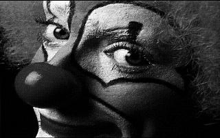
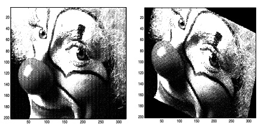
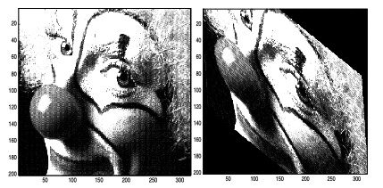

# Design of Visual Systems - Lab One 
## Amy Brons - Design of Visual Systems
Lab was to introduct MATLAB and intro students to basic programming.
MATLAB was installed, the following was the completed code and tasks.

## Pre-task:  Loading the image and printing
The following code was to load and test the image:
`load clown`
`imshow(clown)`

Output:

  
 

## Task 1: Rotating Image
The following code block was developed to:
- Rotate image around the centre of the image
- Use nearest pixel
- If the source pixel lies outside of the image, paint it black
- Make sure the result is same size as the original

Here was my initial code:

                function [Out] =  Rotate(In, Theta)

                    %size of image
                    [rows,cols,~] = size(In);
                    
                    %init output as black (zeros)
                    Out = zeros(rows,cols);
                    
                    %find image centre
                    centerX = (cols+1)/2;
                    centery = (rows+1)/2;
                    
                    %create the tranformation
                    transform = [cos(Theta),- sin(Theta), sin(Theta),cos(Theta)];
                    
                    %find inverse
                    
                    %loop through destination
                    for destX = 1:cols
                        for destY = 1:rows
                            coordX = destX - centerX;
                            coordY = destY - centery;
                    
                    
                            source = transform\[coordX,coordY];
                            sourceX = source(1);
                            sourceY = source(2);
                    
                            x = round(sourceX+centerX);
                            y = round(sourceY+centery);
                    
                            if x >=1 && x <=cols && y >=1 && y <=rows
                                Out (destY, destX) = In(sourceY, sourceX);
                            end
                        end
                    end
                end
                load clown
                t = pi/4
                Out = Rotate(clown, t)

The solution from Professor Cheung:

                %ImageOut = rotate(ImageIn, Theta)
                %
                %Rotates the Image by Theta degrees.

                function [Out] =  rotate(In, Theta)

                %Work out Width and Height of Source image
                width=size(In,1);
                height=size(In,2);

                %Work out the centre point of the image, since we want to rotate about this point.
                cp = [round(size(In,1)/2), round(size(In,2)/2)];

                %The forward transformation matrix
                tm = [ cos(Theta), -sin(Theta) ;
                    sin(Theta), cos(Theta) ]

                %Calculate the reverse mapping by matrix inversion
                rtm = inv (tm);

                for y=1:height
                    for x=1:width
                        p =[x,y];			%Point on the destination image
                        tp = round(rtm*(p-cp)'+cp');	%Calculate nearest corresponding point on the source image
                        if tp(1)<1 | tp(2)<1 | tp(1)>width | tp(2)>height
                            Out(x,y)=0;			%If we are outside the bounds of the image set to black
                        else
                            Out(x,y)=In(tp(1),tp(2));	%Else use the source image
                        end
                    end
                end
 
Output

  
 
   
Looking at my code versus Professor Cheung's solution:
My initial approach kind of worked, but now I can see I made it more complicated than necessary
I had the right basic ideas about finding the center, creating a transformation and handling boundaries
However, the professor's solution showed me a much cleaner way to do it. 
The matrix multiplication especially makes so much more sense now - it's way more efficient than my separate calculations.

Reflection: 
- Evidently, my initial code did not consider all that needed to be counted for rotation. 
- However, with the assistance of the solution code, I was able to rotate this image. 
  
               
## Task 2: Image Shearing 
The resulting image should be the same size as the original. (i.e. the matrix storing the image should have the same dimensions, so some clipping of the image may occur).
If a source pixel lies outside the image you should paint it black.
Use “nearest pixel” only, as before.
You should centre the sheared result (i.e. the centre pixel of the image remains stationary).
The shear values (Xshear, and Yshear) should be expressed as fractions of the images width and height respectively.

My initial code:

                function [Out] = Shear (In, shearX, shearY)
                    [h,w,~] = size(In);

                    Out = zeros(h,w,"like", In);

                    centerX = w/2;
                    centerY = h/2;

                    sMatrix = [1,shearX; shearY, 1];
                    inverse = inv(sMatrix);

                    for y = 1:h
                        for x = 1:w
                            newX =x-centerX;
                            newY =y-centerY;

                            input = inverse*[newX;newY];
                            inputX = input(1)+centerX;
                            inputY = input(2)+centerY;

                            nearestx = round(inputX);
                            nearesty = round(inputY);

                            if nearestx >=1 && nearestx <=w && nearesty >=1 && nearesty <=h
                                Out(y,x,:) = In(nearesty, nearestx,:);
                            end
                        end
                    end
                end

Professor Cheung's solution:
                function [Out] =  Shear(In, xshear, yshear)

                %Work out Width and Height of Source image
                width=size(In,1);
                height=size(In,2);

                %Work out the centre point of the image, since we want to shear about this point.
                cp = [round(size(In,1)/2), round(size(In,2)/2)];

                %The forward transformation matrix
                tm = [ 1, xshear ;
                    yshear, 1 ];

                %Calculate the reverse mapping by inversion
                rtm = inv (tm);

                for y=1:height
                    for x=1:width
                        p =[x,y];			%Point on the destination image
                        tp = round((p-cp)*rtm+cp);	%Calculate nearest corresponding point on the source image
                        if tp(1)<1 | tp(2)<1 | tp(1)>width | tp(2)>height
                            Out(x,y)=0;			%If we are outside the bounds of the image set to black
                        else
                            Out(x,y)=In(tp(1),tp(2));	%Else use the source image
                        end
                    end
                end
 
Output

  
 

Comments:
Looking at my outputs versus the expected results helped me understand where my code needed improvement. I tried to jump straight into coding at first, but taking time to understand the transformation matrices first is the better approach. It's pretty cool to see how these basic transformations can be combined to create more complex image manipulations.
The debugging process was challenging but rewarding - especially when I finally got the rotated image to look right! It's interesting how something that seems simple at first (just rotating an image) actually involves quite a bit of mathematical thinking and careful coding.
I can definitely see how these concepts will be useful for more complex image processing tasks later in the course. The way we handle coordinates and transformations seems like it would be fundamental for things like computer vision and graphics processing.
